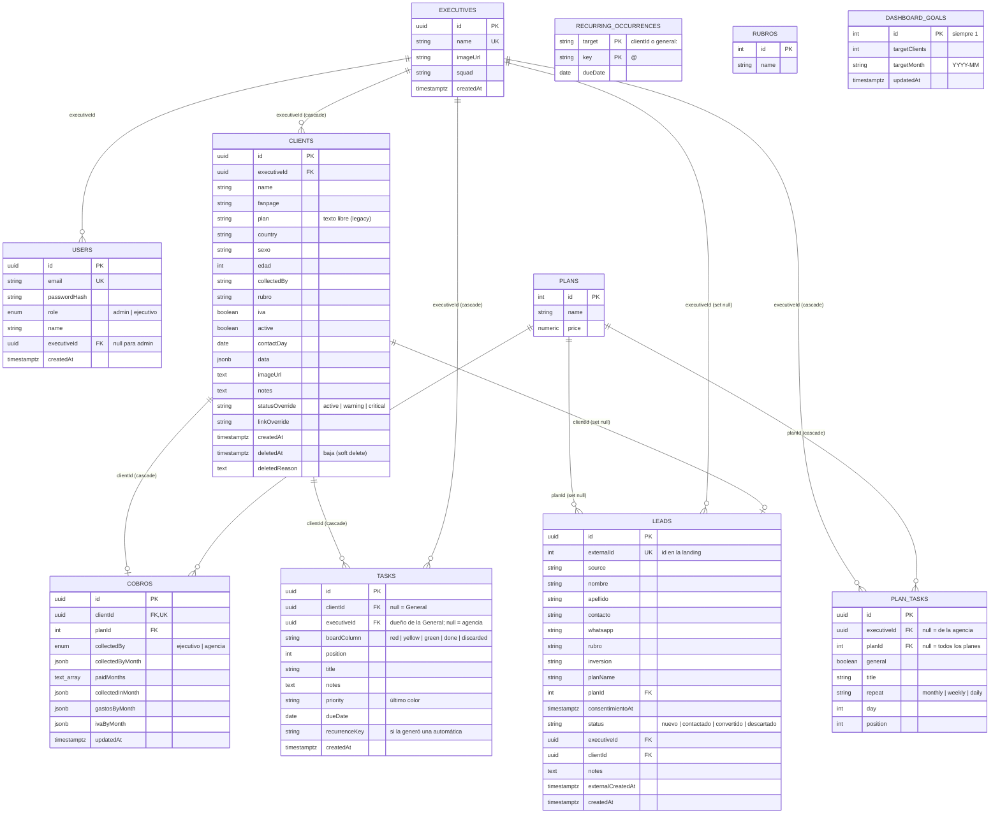

# Gestión Ejecutivos — Backend

API REST para gestionar ejecutivos de cuenta, su cartera de clientes y los cobros mensuales de cada cliente.

Stack: **NestJS 11** · **TypeORM** · **PostgreSQL 16** · **JWT (passport-jwt)** · **class-validator**

---

## Índice

- [Requisitos](#requisitos)
- [Puesta en marcha local](#puesta-en-marcha-local)
- [Variables de entorno](#variables-de-entorno)
- [Scripts](#scripts)
- [Seed](#seed)
- [Docker](#docker)
- [Estructura del proyecto](#estructura-del-proyecto)
- [Autenticación y roles](#autenticación-y-roles)
- [Endpoints](#endpoints)
- [Modelo de datos](#modelo-de-datos)
- [Decisiones de diseño](#decisiones-de-diseño)

---

## Requisitos

- Node.js 22
- Yarn
- PostgreSQL 16 (local o vía Docker)

## Puesta en marcha local

```bash
# 1. Instalar dependencias
yarn install

# 2. Configurar variables de entorno
cp .env.example .env
# editar .env con los datos de tu base

# 3. Crear la base (si no existe)
createdb gestion_ejecutivos

# 4. Cargar datos iniciales (admin, planes, ejecutivos y clientes de ejemplo)
yarn seed

# 5. Levantar en modo desarrollo (con watch)
yarn start:dev
```

La API queda en `http://localhost:3000/api`.

Con `DB_SYNC=true`, TypeORM crea/actualiza las tablas automáticamente a partir de las entidades al arrancar. No hay migraciones.

## Variables de entorno

| Variable         | Default              | Descripción                                                        |
| ---------------- | -------------------- | ------------------------------------------------------------------ |
| `DB_HOST`        | `localhost`          | Host de Postgres                                                   |
| `DB_PORT`        | `5432`               | Puerto de Postgres                                                 |
| `DB_USER`        | `postgres`           | Usuario de Postgres                                                |
| `DB_PASSWORD`    | `postgres`           | Contraseña de Postgres                                             |
| `DB_NAME`        | `gestion_ejecutivos` | Nombre de la base                                                  |
| `DB_SYNC`        | `true`               | Si es `true`, TypeORM sincroniza el esquema con las entidades      |
| `JWT_SECRET`     | `dev-secret-change-me` | Secreto para firmar los tokens. **Cambiar en producción**        |
| `ADMIN_EMAIL`    | `admin@empresa.com`  | Email del admin que crea el seed                                   |
| `ADMIN_PASSWORD` | `admin123`           | Contraseña del admin que crea el seed                              |
| `PORT`           | `3000`               | Puerto HTTP                                                        |
| `VB_WEBHOOK_SECRET` | —                 | Secreto HMAC compartido con vb-api para el webhook de la landing (mín. 32 caracteres). Sin él, el webhook responde `503` |
| `APP_TIMEZONE`   | `America/Argentina/Buenos_Aires` | Zona horaria de "hoy" en el tablero de tareas y del cron de las automáticas |

## Scripts

| Script            | Qué hace                                             |
| ----------------- | ---------------------------------------------------- |
| `yarn start:dev`  | Levanta la API en modo desarrollo con hot reload     |
| `yarn start`      | Levanta la API sin watch                             |
| `yarn build`      | Compila a `dist/`                                    |
| `yarn start:prod` | Corre la versión compilada (`node dist/main.js`)     |
| `yarn seed`       | Ejecuta el seed con ts-node (desarrollo)             |
| `yarn seed:prod`  | Ejecuta el seed compilado (`dist/seed/seed.js`)      |
| `yarn test`       | Tests e2e (Jest + supertest) contra Postgres en memoria (pg-mem), no necesita base. Corre con `TZ=UTC` porque pg-mem devuelve las columnas `date` como medianoche UTC |

## Seed

[src/seed/seed.ts](src/seed/seed.ts) es idempotente (se puede correr varias veces) y carga:

1. **Planes** por defecto (upsert por id):
   - `1` Plan ejecución — 350
   - `2` Plan ejecución + creatividades — 490
   - `3` Plan ejecución + Bot — 550
2. **Admin** con `ADMIN_EMAIL` / `ADMIN_PASSWORD` (si no existe).
3. **Ejecutivos y clientes** importados de la planilla de gestión original, con su cobro apuntando al plan según el monto en USD.
4. **Un usuario por ejecutivo** que todavía no tenga uno, con la convención `<primerNombre>@empresa.com` / `<primerNombre>123` (sin acentos, en minúsculas). Ej: `Marco Calandra` → `marco@empresa.com` / `marco123`. Si el email ya existe se agrega un sufijo numérico (`marco2@…`).

> Las credenciales generadas se imprimen por consola. Son para desarrollo: en producción conviene cambiarlas.

## Docker

El [Dockerfile](Dockerfile) hace un build multi-stage (`node:22-alpine`) y expone el puerto 3000.

[docker-compose.yml](docker-compose.yml) levanta Postgres + backend. Usa una red externa, así que hay que crearla una vez:

```bash
docker network create gestion-ejecutivos-net
docker compose up -d --build

# Seed dentro del contenedor
docker exec -it gestion-ejecutivos-backend node dist/seed/seed.js
```

## Estructura del proyecto

```
src/
├── main.ts              # Bootstrap: CORS, ValidationPipe global, prefijo /api
├── app.module.ts        # Config + conexión TypeORM + módulos
├── auth/                # Login, JWT strategy, guards y decoradores de roles
├── users/               # Usuarios de login (admin / ejecutivo)
├── executives/          # Ejecutivos: CRUD, importación, traspaso de clientes, crecimiento
├── clients/             # Clientes, su cobro, bajas y ficha (notas/estado/link)
├── cobros/              # Entidades Cobro y Plan + CRUD de planes
├── rubros/              # Lista configurable de rubros
├── goals/               # Objetivo general del equipo (dashboard)
├── leads/               # Solicitudes de la landing: webhook de vb-api y gestión desde el panel
├── tasks/               # Tablero de tareas y tareas automáticas (cron diario)
└── seed/                # Script de carga inicial
```

Cada módulo sigue el esquema estándar de Nest: `*.module.ts`, `*.controller.ts`, `*.service.ts`, `*.entity.ts` y `dto/`.

La validación de entrada es global (`ValidationPipe` con `whitelist: true` y `transform: true`): los campos que no están en el DTO se descartan.

## Autenticación y roles

- `POST /api/auth/login` devuelve `{ accessToken, user }`.
- El resto de los endpoints requieren el header `Authorization: Bearer <accessToken>`.
- Los tokens expiran a las **8 horas**.
- El payload del token incluye `sub`, `email`, `role` y `executiveId`.

Hay dos roles:

| Rol         | Alcance                                                                                          |
| ----------- | ------------------------------------------------------------------------------------------------ |
| `admin`     | Ve y modifica todo. Es el único que gestiona ejecutivos, usuarios, planes, rubros y objetivos.   |
| `ejecutivo` | Solo ve y modifica su propio ejecutivo y los clientes de su cartera (`executiveId` del usuario). |

Los endpoints marcados con `@Roles(UserRole.ADMIN)` usan `RolesGuard`. El acceso por cartera (que un ejecutivo no toque clientes de otro) se valida en los services (`findOwnedClient` en clientes, `assertAccess` en ejecutivos) y responde `403`.

## Endpoints

Todas las rutas llevan el prefijo `/api`. 🔒 = requiere JWT · 👑 = solo admin.

### Auth

| Método | Ruta          | Descripción                     |
| ------ | ------------- | ------------------------------- |
| POST   | `/auth/login` | Login con `{ email, password }` |
| GET    | `/auth/me` 🔒 | Usuario del token actual        |

### Usuarios

| Método | Ruta          | Descripción                                                                  |
| ------ | ------------- | ---------------------------------------------------------------------------- |
| GET    | `/users` 👑   | Lista usuarios (sin `passwordHash`)                                          |
| POST   | `/users` 👑   | Crea usuario `{ name, email, password, role, executiveId? }`                 |

### Ejecutivos 🔒

| Método | Ruta                                  | Descripción                                                                                       |
| ------ | ------------------------------------- | ------------------------------------------------------------------------------------------------- |
| GET    | `/executives`                         | Admin: todos. Ejecutivo: solo el suyo. Incluye clientes, `clientCount` y `activeCount`            |
| GET    | `/executives/growth/general`          | Clientes acumulados de toda la empresa en los últimos 12 meses (array de 12 números)              |
| GET    | `/executives/:id`                     | Detalle de un ejecutivo                                                                            |
| POST   | `/executives` 👑                      | Crea ejecutivo `{ name, squad?, email?, password? }`. Con email+password crea también su usuario  |
| PATCH  | `/executives/:id` 👑                  | Edita `{ name?, squad? }`                                                                          |
| DELETE | `/executives/:id` 👑                  | Elimina ejecutivo y su usuario. Falla con `409` si todavía tiene clientes (incluidas bajas)        |
| POST   | `/executives/:id/transfer-clients` 👑 | Traspasa clientes a `targetExecutiveId`. Si se omite `clientIds`, traspasa toda la cartera        |
| POST   | `/executives/import` 👑               | Importación masiva de ejecutivos con sus clientes (ver advertencia abajo)                          |
| PATCH  | `/executives/:id/image`               | Cambia la foto `{ imageUrl }` (admin o el propio ejecutivo)                                        |

> ⚠️ **`POST /executives/import` reemplaza la cartera**: por cada ejecutivo importado borra físicamente todos sus clientes (y en cascada sus cobros y tareas) y los vuelve a crear con lo que viene en el body.

### Clientes 🔒

| Método | Ruta                             | Descripción                                                                                        |
| ------ | -------------------------------- | -------------------------------------------------------------------------------------------------- |
| GET    | `/clients`                       | Clientes visibles para el usuario, con `executive`, `cobro` y `cobro.plan`                         |
| POST   | `/clients`                       | Crea cliente. El admin debe indicar `executiveId`; el ejecutivo lo crea en su propia cartera      |
| PATCH  | `/clients/:id`                   | Edita datos del cliente                                                                            |
| PATCH  | `/clients/:id/cobro`             | Edita el cobro: `planId`, `paidMonths`, `collectedByMonth`, `collectedInMonth`, `gastosByMonth`, `ivaByMonth` |
| PATCH  | `/clients/:id/image`             | Cambia la foto `{ imageUrl }` (URL o data URI)                                                     |
| PATCH  | `/clients/:id/extras`            | Ficha extendida: `{ notes?, statusOverride?, linkOverride? }`                                      |
| DELETE | `/clients/:id`                   | **Baja** (soft delete): marca `deletedAt`                                                          |
| PATCH  | `/clients/:id/baja`              | Edita fecha (`deletedAt`) y motivo (`deletedReason`) de la baja                                    |
| DELETE | `/clients/:id/baja`              | Anula la baja: el cliente vuelve a estar vigente                                                   |
| DELETE | `/clients/:id/permanent`         | Borrado definitivo. Solo se permite sobre clientes ya dados de baja                                |

Cambiar `contactDay`, `active` o `cobro.planId`, dar de baja, anular la baja o traspasar clientes recalcula sus tareas automáticas futuras.

### Tareas 🔒

Tablero de tareas (página Tareas del front y pestaña To Do de la ficha). Cada tarea está en una carpeta: la de un cliente o `general`. El admin ve los clientes de todos y la General de la agencia; un ejecutivo, solo su cartera y su propia General. Los clientes dados de baja no aparecen.

| Método | Ruta               | Descripción                                                                                                   |
| ------ | ------------------ | ------------------------------------------------------------------------------------------------------------- |
| GET    | `/tasks/state`     | `{ today, folders, tasks, planTasks }`: carpetas (clientes visibles, con plan y `cycleStart`), tareas y automáticas |
| POST   | `/tasks`           | Crea `{ id (uuid), folderId, column, title, notes?, dueDate? }` arriba de todo en la columna                    |
| PATCH  | `/tasks/:id`       | Edita `{ title?, notes?, dueDate? }` (`dueDate: null` quita la fecha)                                          |
| POST   | `/tasks/:id/move`  | Mueve `{ folderId, column, order? }`; `order` = ids de la columna destino en el nuevo orden                    |
| DELETE | `/tasks/:id`       | Elimina la tarea                                                                                              |

`column`: `red` · `yellow` · `green` · `done` · `discarded`. Una tarea con `dueDate` aparece en el tablero recién ese día.

### Tareas automáticas 🔒

| Método | Ruta          | Descripción                                                                                                    |
| ------ | ------------- | -------------------------------------------------------------------------------------------------------------- |
| GET    | `/plan-tasks` | Admin: las de la agencia. Ejecutivo: las de la agencia que aplican a sus clientes (solo lectura) y las suyas   |
| PUT    | `/plan-tasks` | Reemplaza `{ tasks: [{ id, general, planId, title, repeat, day }] }`: el admin, las de la agencia; un ejecutivo, las suyas |

- `repeat`: `monthly` (con `day` 1–31 del ciclo; 31 = el vencimiento), `weekly` (`day` 1 = lunes … 7 = domingo) o `daily`. `{mes}` en el título se reemplaza por el nombre del mes.
- En un cliente, el ciclo es el de cobro: arranca en `contactDay` y se renueva ese día todos los meses. Solo se generan en clientes **activos, con `contactDay`, sin baja y con plan en el cobro**, según `planId` (null = cualquier plan). Las de un ejecutivo, solo en su cartera.
- `general: true` = no es de ningún cliente: va a la General de quien la configuró (la de la agencia o la del ejecutivo), siguiendo el mes calendario.
- Se generan con 45 días de anticipación (las diarias, 7) al arrancar, todos los días a las 00:05 y cuando cambia algo que las afecta. Guardar recalcula las que todavía no llegaron a su fecha. Una tarea automática borrada no vuelve a aparecer.

### Planes 🔒

| Método | Ruta            | Descripción                    |
| ------ | --------------- | ------------------------------ |
| GET    | `/plans`        | Lista planes                   |
| POST   | `/plans` 👑     | Crea plan `{ name, price }`    |
| PUT    | `/plans/:id` 👑 | Edita plan `{ name, price }`   |
| DELETE | `/plans/:id` 👑 | Elimina plan (los cobros que lo usaban quedan con `planId = null`) |

### Rubros 🔒

| Método | Ruta         | Descripción                                          |
| ------ | ------------ | ---------------------------------------------------- |
| GET    | `/rubros`    | Lista rubros                                         |
| PUT    | `/rubros` 👑 | Reemplaza la lista completa `{ names: string[] }`    |

### Objetivo del equipo 🔒

| Método | Ruta        | Descripción                                                       |
| ------ | ----------- | ----------------------------------------------------------------- |
| GET    | `/goals`    | Objetivo actual (o vacío si no hay)                               |
| PUT    | `/goals` 👑 | Define el objetivo `{ targetClients, targetMonth: 'YYYY-MM' }`    |
| DELETE | `/goals` 👑 | Borra el objetivo                                                 |

### Solicitudes (leads) 🔒

Las solicitudes llegan desde el formulario público de la landing de Vamos Bien vía webhook (ver abajo) y se gestionan desde el panel.

| Método | Ruta                       | Descripción                                                                                                   |
| ------ | -------------------------- | ------------------------------------------------------------------------------------------------------------- |
| GET    | `/leads?status=&executiveId=` | Admin: todas (filtra por `executiveId` si viene). Ejecutivo: solo las asignadas a él. Con `executive` y `plan` |
| GET    | `/leads/count-new`         | `{ count }` de solicitudes visibles en estado `nuevo` (contador del menú)                                      |
| PATCH  | `/leads/:id`               | `{ status?, notes? }` (`nuevo \| contactado \| descartado`). `executiveId` y `planId` solo el admin             |
| POST   | `/leads/:id/convert` 👑    | Crea el cliente (y su cobro si hay plan) y marca la solicitud `convertido`. Body opcional `{ executiveId?, planId?, rubro? }`. `409` si ya estaba convertida |

### Webhook de la landing (público, firmado)

`POST /api/webhooks/vb` lo llama solo vb-api por la red de Docker `gestion-ejecutivos-net` (`http://gestion-ejecutivos-backend:3000/api/webhooks/vb`). No usa JWT: se autentica con HMAC. El nginx del front devuelve `404` en `/api/webhooks/` para que no sea accesible desde internet.

- Headers: `x-vb-timestamp` (segundos Unix) y `x-vb-signature: sha256=<hex(HMAC_SHA256(VB_WEBHOOK_SECRET, "<timestamp>.<rawBody>"))>`.
- `503` sin secreto configurado · `401` firma inválida o timestamp a más de 300 s · `400` body inválido · `200 { ok: true }` en el resto.
- Idempotente por el `id` de la aplicación (`leads.externalId`, `ON CONFLICT DO NOTHING`): los reintentos de vb-api responden `200` sin duplicar.
- Eventos distintos de `aplicacion.creada` responden `200` sin hacer nada.
- El plan se resuelve por nombre contra `plans` (sin distinguir mayúsculas ni espacios de más); si no coincide queda `planId = null`.

### Ejemplo

```bash
TOKEN=$(curl -s -X POST http://localhost:3000/api/auth/login \
  -H 'Content-Type: application/json' \
  -d '{"email":"admin@empresa.com","password":"admin123"}' | jq -r .accessToken)

curl -H "Authorization: Bearer $TOKEN" http://localhost:3000/api/clients
```

## Modelo de datos



### Cobros por mes

Todo lo mensual del cobro se indexa por `yearMonth` con formato `'YYYY-MM'`:

| Campo              | Tipo                          | Significado                                                                              |
| ------------------ | ----------------------------- | ---------------------------------------------------------------------------------------- |
| `paidMonths`       | `string[]`                    | Meses que el cliente tiene pagos                                                         |
| `collectedByMonth` | `{ [ym]: 'ejecutivo' \| 'agencia' }` | Quién cobró cada mes                                                              |
| `collectedInMonth` | `{ [ym]: ym }`                | En qué mes entró realmente la plata. Ej: `{'2026-07': '2026-08'}` = julio pagado en agosto |
| `gastosByMonth`    | `{ [ym]: number }`            | Gasto puntual de ese mes                                                                 |
| `ivaByMonth`       | `{ [ym]: boolean }`           | Recordatorio de facturar con IVA ese mes (solo informativo, no afecta montos)            |

## Decisiones de diseño

- **Bajas como soft delete.** Eliminar un cliente solo setea `deletedAt` para no perder el historial de cobros. Los clientes dados de baja siguen viajando en las respuestas (Cobros los necesita para los meses anteriores a la baja) pero no cuentan en `clientCount`/`activeCount` ni en el crecimiento. El borrado físico existe aparte (`DELETE /clients/:id/permanent`) y solo para clientes ya dados de baja.
- **`Plan.price` como número.** Postgres devuelve `numeric` como string; la entidad usa un transformer para devolverlo como `number` y evitar concatenaciones en el front.
- **Plan y rubro del cliente como texto.** `clients.plan` y `clients.rubro` se guardan por nombre, desacoplados de las tablas de configuración, para que esas listas se puedan editar libremente. El plan "real" para el cobro es `cobros.planId`.
- **`statusOverride` como varchar**, no enum de Postgres, para poder agregar estados sin `ALTER TYPE`.
- **Objetivo del dashboard como singleton**: `dashboard_goals` tiene a lo sumo una fila con `id = 1`.
- **Sin migraciones**: el esquema se sincroniza desde las entidades (`DB_SYNC=true`). Ojo con renombrar o borrar columnas: `synchronize` puede eliminar datos.
- **To Do viejo → tablero**: al arrancar, si existe la tabla `client_todos` (el To Do anterior de la ficha), sus filas pasan a `tasks` (pendientes a Amarillo, hechas a Hecho, mismo id) y la tabla se renombra a `client_todos_migrado`. No se borra nada (ver `src/tasks/client-todos.migration.ts`).
- **CORS abierto**: `main.ts` habilita CORS para cualquier origen. En producción conviene restringirlo al dominio del front (hay un ejemplo comentado en [src/main.ts](src/main.ts)).
